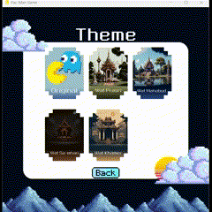

# User Acceptance Test

## การเปลี่ยนธีม

### 1. อยู่ที่หน้าแรกของเกม จากนั้นกดปุ่ม Theme 
    Expected result: แสดงหน้าธีม

### 2. ภายในหน้าธีม กดปุ่ม Back เพื่อย้อนกลับมายังหน้าแรก

    Expected result: แสดงหน้าแรกพร้อมกับธีมก่อนหน้า

### 3. ภายในหน้าธีม กดเลือกธีมที่ต้องการ ในที่นี้จะเลือกธีม ‘Wat Pra-Sri’

    Expected result: แสดงหน้าแรกพร้อมกับธีมที่เปลี่ยน

### 4. เมื่อเข้ามายังหน้าเกม หน้าของเกมจะเปลี่ยนไปตามธีมที่เลือก รอนับเวลาถอยหลังเกมเริ่ม แล้วเล่นเกม

    Expected result: แสดงหน้าเล่นเกม ธีมเป็นไปตามธีมที่เลือก

### 5. ขณะที่เล่นเกมอยู่ กดปุ่ม Pause ที่ด้านบนขวา

    Expected result: แสดงหน้าเล่นเกม พร้อมกับ pop up ของการหยุดเล่น

### 6. ขณะที่เล่นเกม ถูก ghost ไล่ได้และตาย

     Expected result: แสดงหน้า Game Over

### 7. สามารถชนะเกมได้โดยการกิน pellet ทั้งหมด

    Expected result: แสดงหน้า Success