# User Acceptance Test

## การเปลี่ยนธีม

### 1. อยู่ที่หน้าแรกของเกม จากนั้นกดปุ่ม Theme 
    Expected result: แสดงหน้าธีม

### 2. ภายในหน้าธีม กดปุ่ม Back เพื่อย้อนกลับมายังหน้าแรก

    Expected result: แสดงหน้าแรกพร้อมกับธีมก่อนหน้า

### 3. ภายในหน้าธีม กดเลือกธีมที่ต้องการ ในที่นี้จะเลือกธีม ‘Wat Pra-Sri’

    Expected result: แสดงหน้าแรกพร้อมกับธีมที่เปลี่ยน

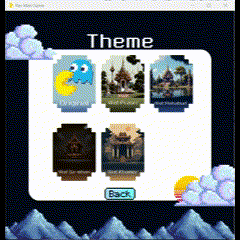

### 4. เมื่อเข้ามายังหน้าเกม หน้าของเกมจะเปลี่ยนไปตามธีมที่เลือก รอนับเวลาถอยหลังเกมเริ่ม แล้วเล่นเกม

    Expected result: แสดงหน้าเล่นเกม ธีมเป็นไปตามธีมที่เลือก

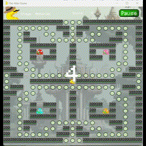

### 5. ขณะที่เล่นเกมอยู่ กดปุ่ม Pause ที่ด้านบนขวา

    Expected result: แสดงหน้าเล่นเกม พร้อมกับ pop up ของการหยุดเล่น

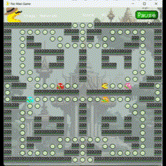

### 6. ขณะที่เล่นเกม ถูก ghost ไล่ได้และตาย

     Expected result: แสดงหน้า Game Over

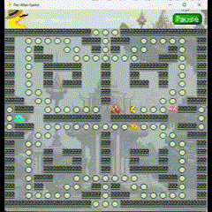

### 7. สามารถชนะเกมได้โดยการกิน pellet ทั้งหมด

    Expected result: แสดงหน้า Success

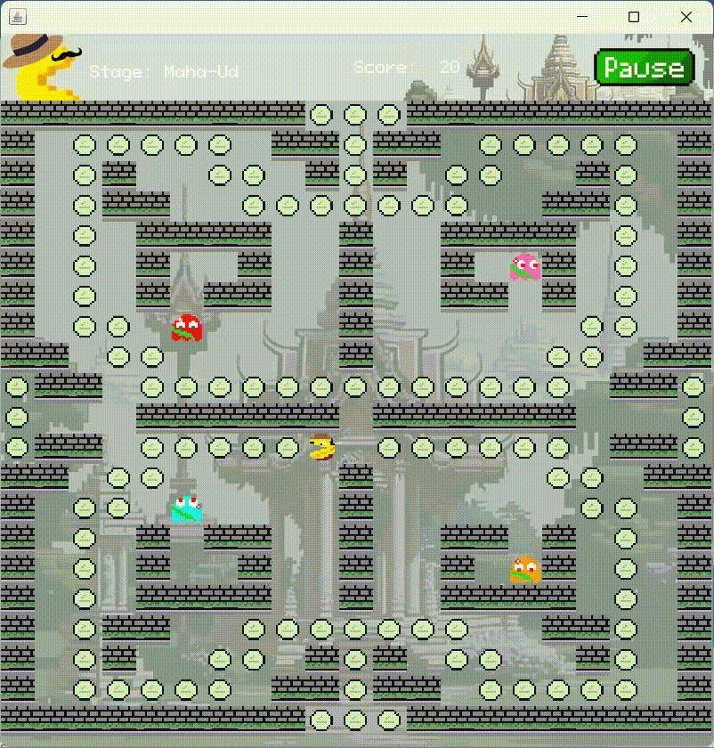

## การเลือกด่าน

### 1. อยู่ที่หน้าแรกของเกม จากนั้นกดปุ่ม Start

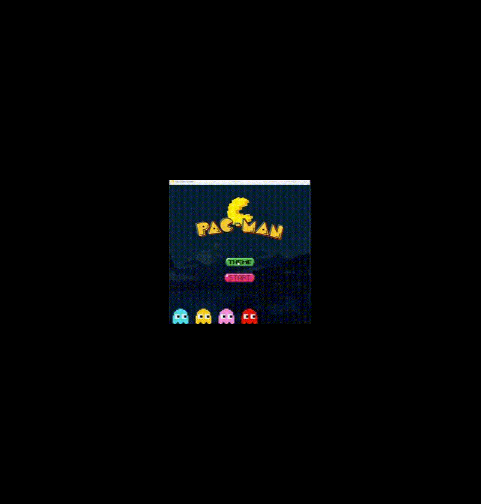

### 2. การเลือกด่าน ‘Maha-ud’

   2.1 เล่นเกมแพ้

   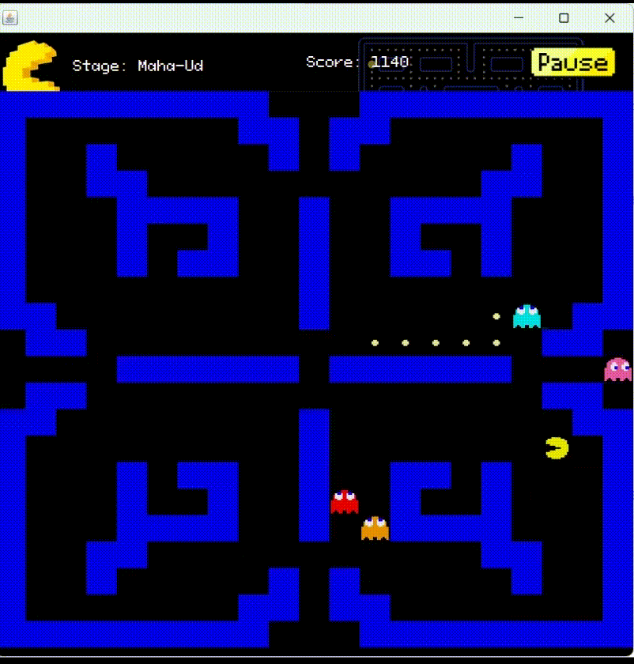

   2.2 เล่นเกมชนะ

   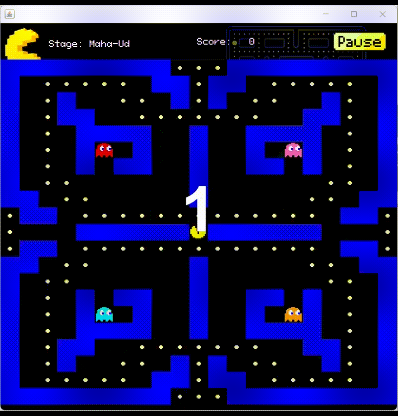

### 3. การเลือกด่าน ‘Takrut Ton’

3.1 เล่นเกมแพ้

3.2 เล่นเกมชนะ

### 4. การเลือกด่าน ‘Chatra Phet’

4.1 เล่นเกมแพ้

4.2 เล่นเกมชนะ

### 5. การเลือกด่าน ‘Phokkasub’

5.1 เล่นเกมแพ้

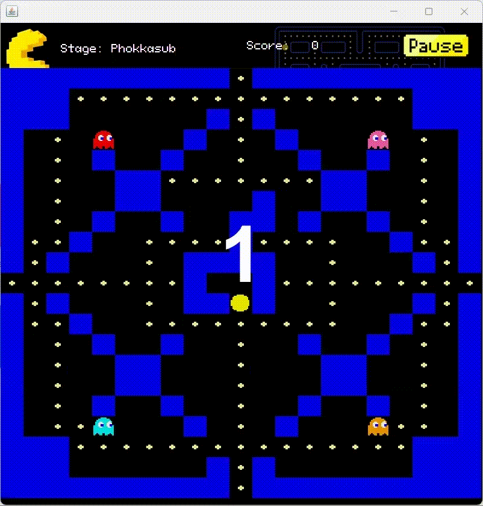

5.2 เล่นเกมชนะ

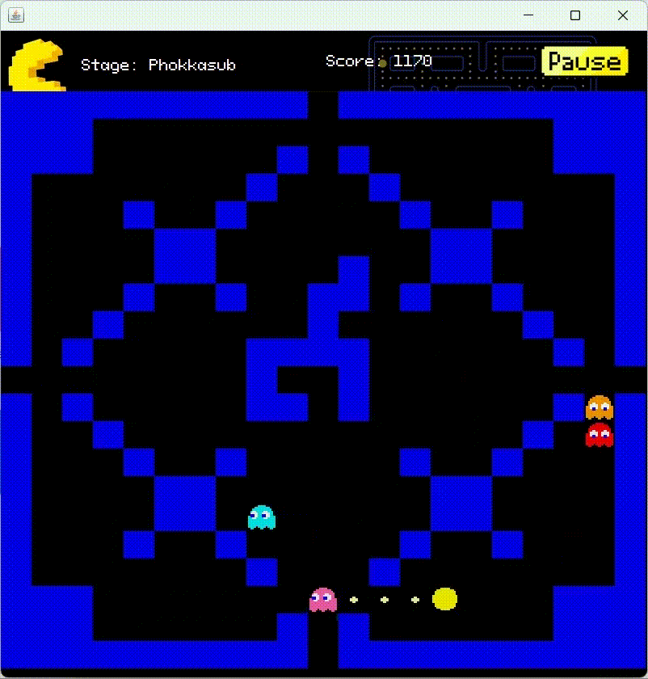

### 6. การเลือกด่าน ‘Praphutnimit’

6.1 เล่นเกมแพ้

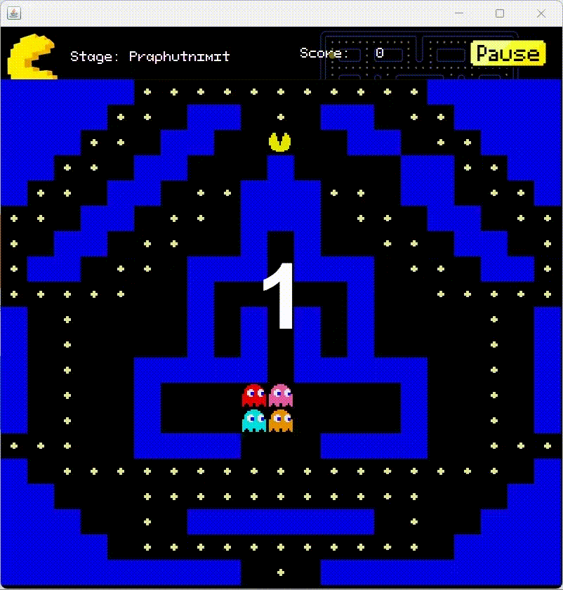

6.2 เล่นเกมชนะ

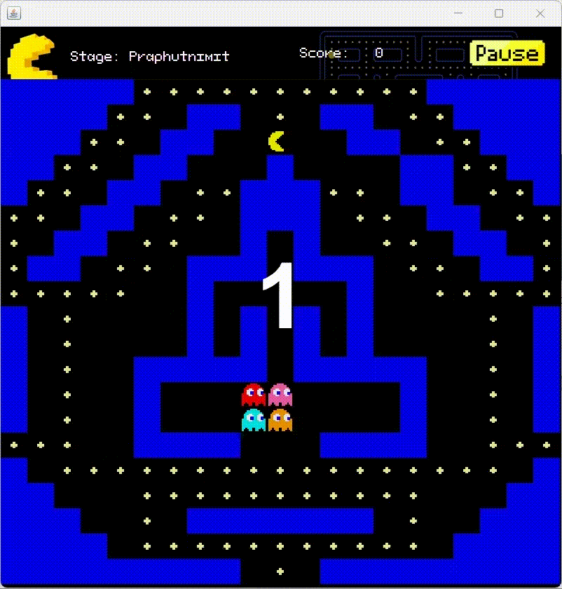

### 7. การกด Pause

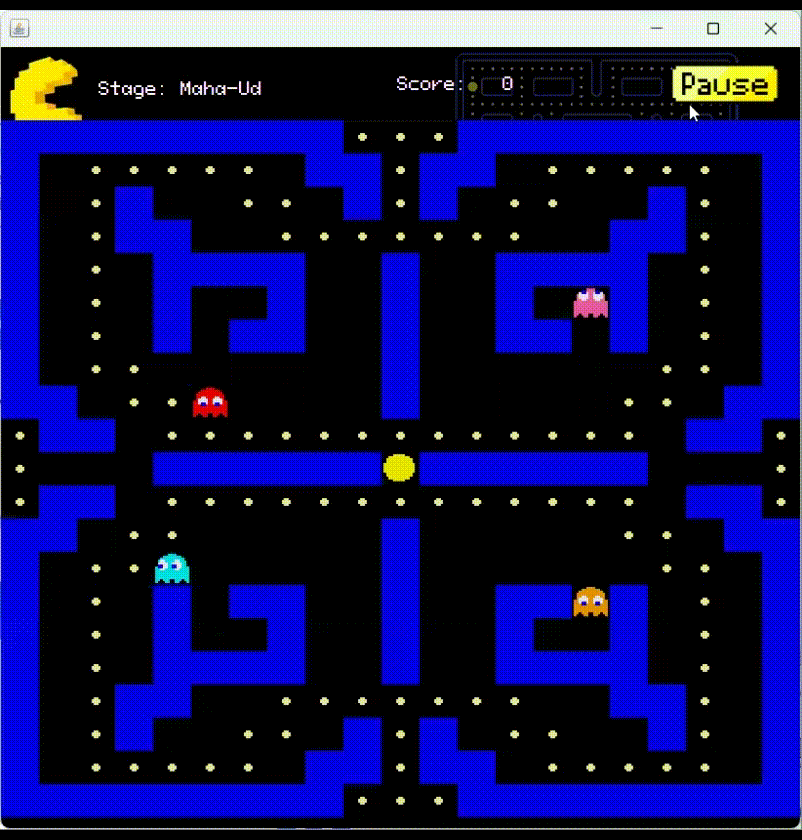

### 8. การกดออกในระหว่างเล่นโดยปุ่ม Pause

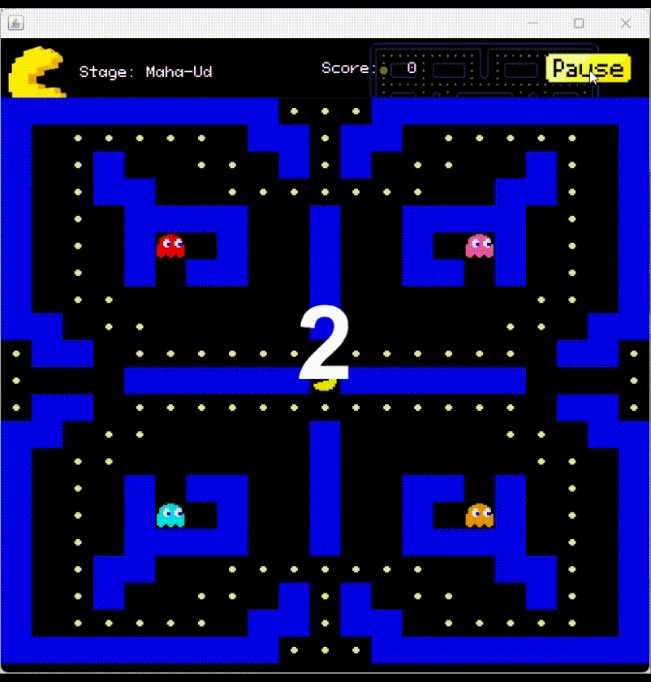

### 9. การกด Resume เพื่อเล่นต่อ

### 10. การกดออกเมื่อแพ้

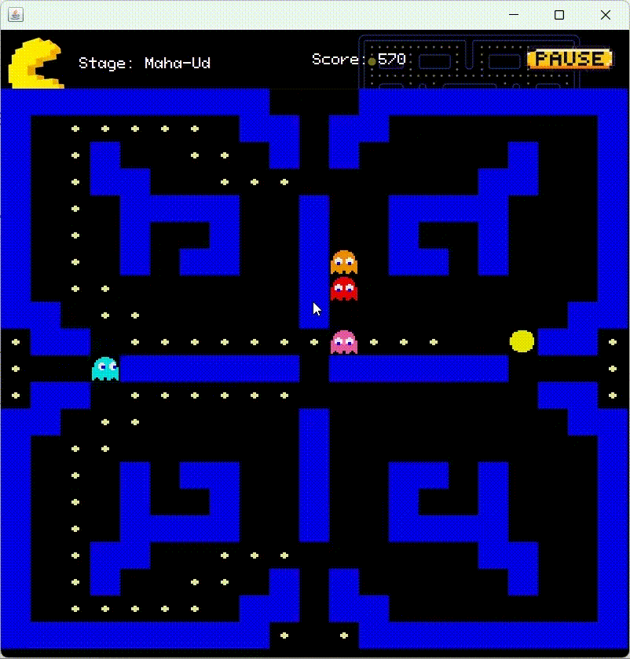

### 11. การกด Restart เมื่อแพ้เพื่อเล่นใหม่

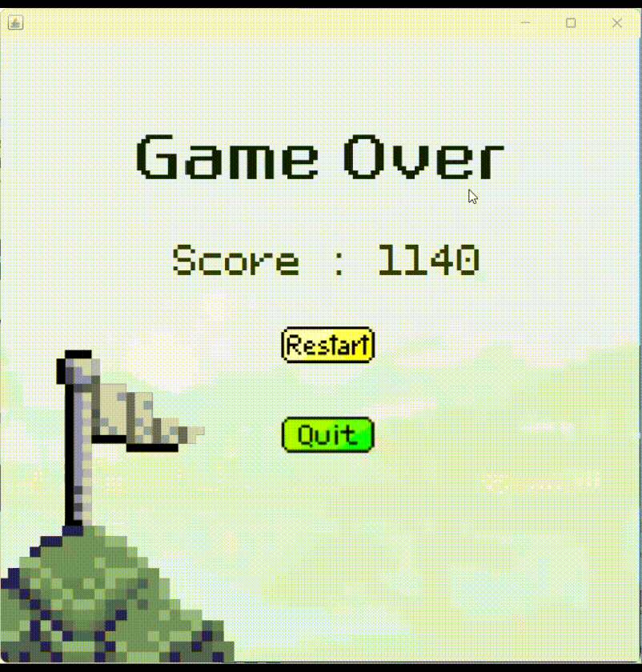

### 12. การกดออกเมื่อชนะ

